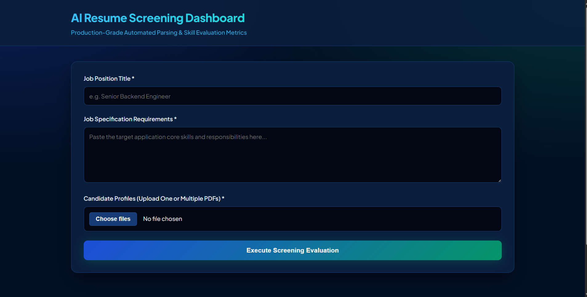
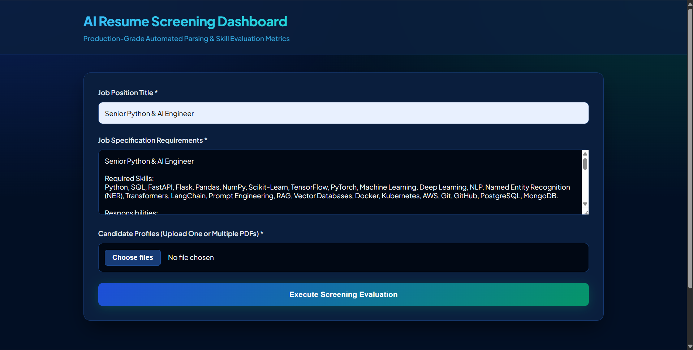
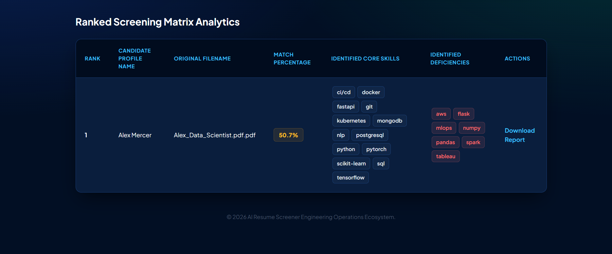
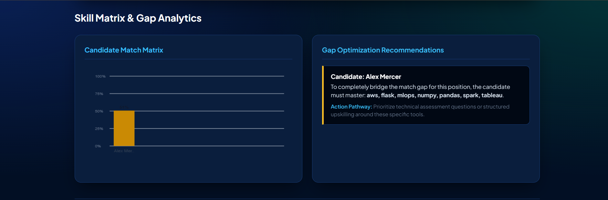

# AI Resume Screening System

## Overview

AI Resume Screening System is a web-based application designed to automate the initial resume screening process. The system analyzes candidate resumes, extracts relevant information, evaluates profiles against job requirements, and generates structured reports to assist recruiters in shortlisting candidates efficiently.

The goal of the project is to reduce manual screening effort, improve consistency in candidate evaluation, and streamline the recruitment workflow.

---

## Features

### Resume Analysis

* Upload and process candidate resumes
* Extract key candidate information
* Analyze qualifications, skills, and experience
* Organize resume data into a structured format

### Candidate Screening

* Evaluate candidate profiles against defined criteria
* Generate screening scores
* Compare multiple candidates
* Assist in shortlisting decisions

### Report Generation

* Generate detailed screening reports
* Store evaluation results
* Provide structured candidate summaries

### Database Management

* Store candidate information securely
* Maintain screening history
* Manage recruitment records efficiently

### User Interface

* Simple and intuitive web interface
* Resume upload functionality
* Real-time screening workflow
* Results visualization and reporting

---

## Screenshots

### Home Dashboard



Main dashboard where recruiters enter job requirements and upload candidate resumes.

---

### Job Specification Example



Example showing a completed job description with required skills and responsibilities.

---

### Candidate Ranking Results



Candidates are ranked according to their match percentage, identified skills, and missing competencies.

---

### Skill Gap Analysis



Visualization of candidate match scores and recommendations for closing skill gaps.

---

## Technology Stack

### Backend

* Python
* Flask
* SQLAlchemy

### Data Processing

* Pandas
* NumPy
* Natural Language Processing (NLP)

### Frontend

* HTML
* CSS
* JavaScript
* Jinja2 Templates

### Database

* SQLite

---

## Project Structure

```text
AI-Resume-Screening-System/
│
├── reports/          # Generated screening reports
├── services/         # Business logic and processing services
├── static/           # CSS, JavaScript, and assets
├── templates/        # HTML templates
│
├── database.py       # Database configuration
├── models.py         # Database models
├── main.py           # Application entry point
├── requirements.txt  # Project dependencies
└── README.md
```

---

## Installation

### Clone Repository

```bash
git clone https://github.com/Barsha2004-Patra/AI-Resume-Screening-System.git
cd AI-Resume-Screening-System
```

### Create Virtual Environment

```bash
python -m venv venv
```

### Activate Environment

Windows

```bash
venv\Scripts\activate
```

Linux / Mac

```bash
source venv/bin/activate
```

### Install Dependencies

```bash
pip install -r requirements.txt
```

### Run Application

```bash
python main.py
```

Open the application in your browser after the server starts.

---

## Key Learning Outcomes

Through this project, I gained practical experience in:

* Building full-stack Python applications
* Designing and integrating databases
* Resume data processing and analysis
* Backend service development
* Web application architecture
* Git and GitHub version control workflows

---

## Future Enhancements

* Advanced NLP-based resume parsing
* Job description matching
* Candidate ranking algorithms
* Skill gap analysis
* Recruiter dashboard and analytics
* Authentication and authorization
* Export reports to PDF
* Cloud deployment

---

## Author

**Barsha Patra**

B.Tech Computer Science Engineering

Aspiring Data Science & AI Engineer

---

### ⭐ If you found this project useful, consider giving it a star.
